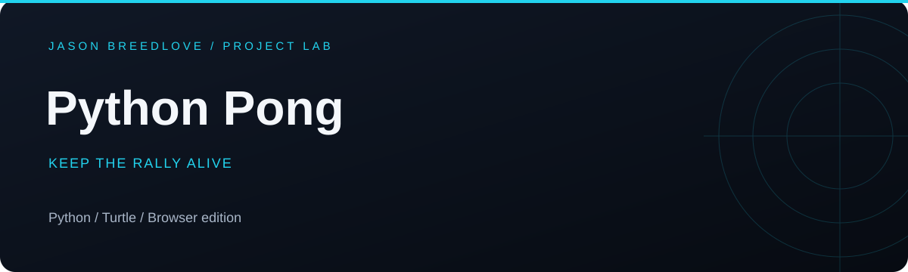

[Open live app](https://pong.jasonbreedlove.dev) · [Portfolio](https://www.jasonbreedlove.dev) · [Browse source](https://github.com/Breedlove-Jason/pong)

<div style="text-align: center">
<h1> Pong Game</h1>
</div>

> **Browser edition:** The deployed Arcade version lives on [feat/arcade-browser](https://github.com/Breedlove-Jason/pong/tree/feat/arcade-browser). This default branch preserves the original Turtle implementation documented below.

## Description

The Pong Game project is a classic implementation of the Pong game using the Turtle graphics library in Python. The game includes two paddles and a ball. The left paddle is controlled by the computer, and the right paddle is controlled by the player. The goal is to score points by getting the ball past the opponent's paddle.

## How to Play

1. Run the `main.py` script.
2. Use the arrow keys to control the right paddle:
    - Up: Move up
    - Down: Move down
3. The computer controls the left paddle.
4. The game ends when the ball goes past the paddles, and the score is updated.

## Files

- `main.py`: The main script that runs the Pong game.

## Running the Project

To run the project, navigate to the `pong-game` directory and execute the `main.py` script using Python:

```bash
cd pong-game
python main.py
```